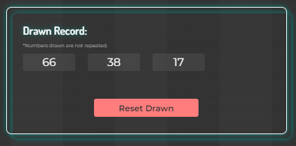
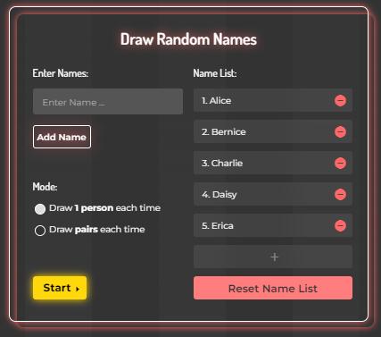
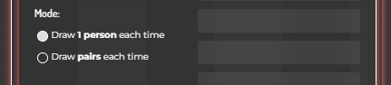

<h1 style="text-align:center">Lucky Draw Tool</h1>

## Introduction

URL:
<https://wy-chan.github.io/lucky_draw>

This page is suitable for lucky draw in parties!

### [Option 1 - Draw Random Numbers](#Option-1)
### [Option 2 - Draw Random Names](#Option-2)

## Option-1
### Draw Random Numbers
1. Enter the range of numbers, then click "start".
     
   *maximum range limit: 0 to 100,000
    

2. Click "Draw" to draw a number.
   

3. After a number is drawn, you can click "next" to draw the next number. All numbers drawn are not repeated. 
   

4. The list of drawn numbers can be found in the "Drawn Record" section. By clicking the "Reset Drawn" button, the drawn record will be cleared.
   

## Option-2
### Draw Random Names
1. Enter names at the "Enter Name..." input field, then click "Add Name" to add a name on the list.
   
*maximum length of name: 15 characters
   

   
  Name list is shown on the right. Names can be deleted by clicking the "-" buttons.
     

2. Mode: select 1 names or 2 names to be drawn each time.
  

3. Click "Draw" to draw a name/ pair of names.
   
 
4. After a name/pair of names is drawn, you can click "next" to draw the next name/pairs.
   
 
5. The list of drawn names can be found in the "Drawn Record" section. By clicking the "Reset Drawn" button, the drawn record will be cleared.
   
